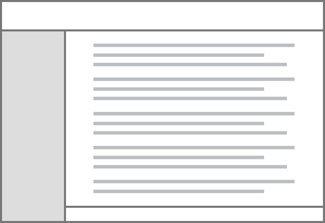
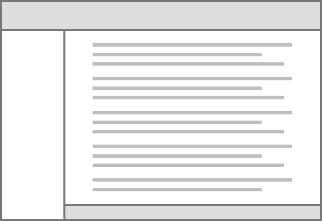

 

          
<small>Bootstrap by default offers a powerful grid system and a few wrapping containers for laying out your project. Layout component created specifically for the Elephant, allows full and effective control on regions such as: header, footer, sidebar and content. By changing variable values stated in _variables.scss file, under the section Layout you can change these region’s dimensions, colours, etc.</small>

          
<small><strong>Sidebar sticky*</strong> - by scrolling up and down the page, the menu placed on the sidebar moves along with the content until the bottom of the menu is reached. (inspired by WordPress)</small>

          

            

              

                <h5>Static layout</h5>
                
                

                  <small>Regions: header, sidebar, content.</small>
                

              

            

            

              

                <h5>Static layout with footer</h5>
                
                

                  <small>Regions: header, footer, sidebar, content.</small>
                

              

            

            

              

                <h5>Sidebar sticky*</h5>
                
                

                  <small>Regions: header, footer, sidebar, content.</small>
                

              

            

            

              

                <h5>Sidebar sticky* collapsed</h5>
                
                

                  <small>Regions: header, footer, sidebar, content.</small>
                

              

            

            

              

                <h5>Header fixed</h5>
                
                

                  <small>Regions: header, footer, sidebar, content.</small>
                

              

            

            

              

                <h5>Header and sidebar fixed</h5>
                
                

                  <small>Regions: header, footer, sidebar, content.</small>
                

              

            

            

              

                <h5>Footer fixed</h5>
                
                

                  <small>Regions: header, footer, sidebar, content.</small>
                

              

            

            

              

                <h5>+ Other combinations</h5>
                
                

                  <small>Regions: header, footer, sidebar, content.</small>
                

              

            

          

        
